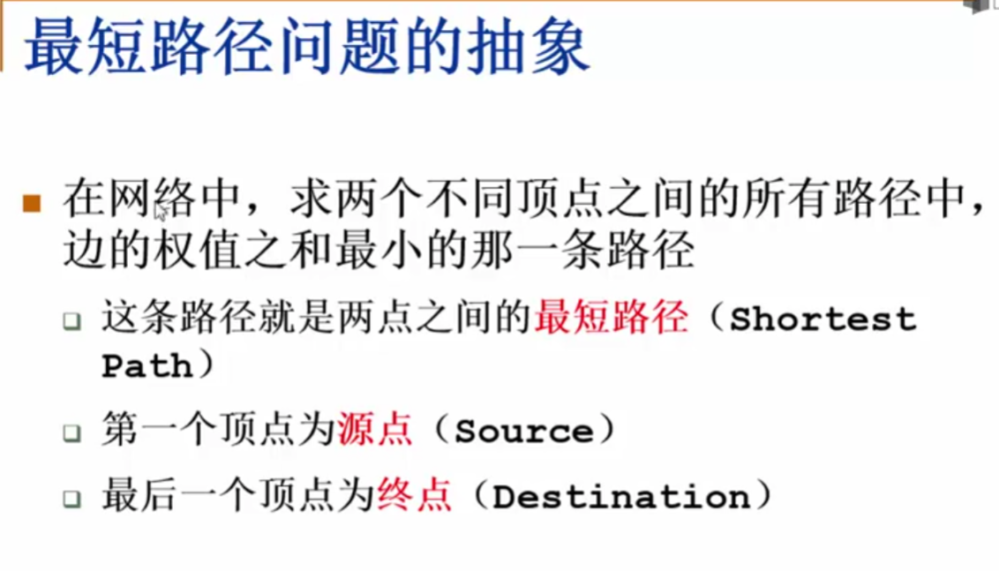
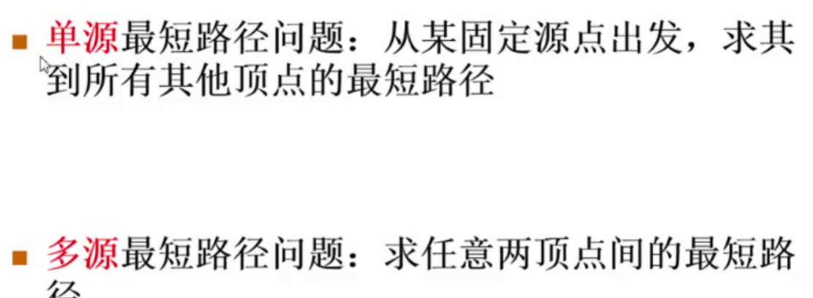
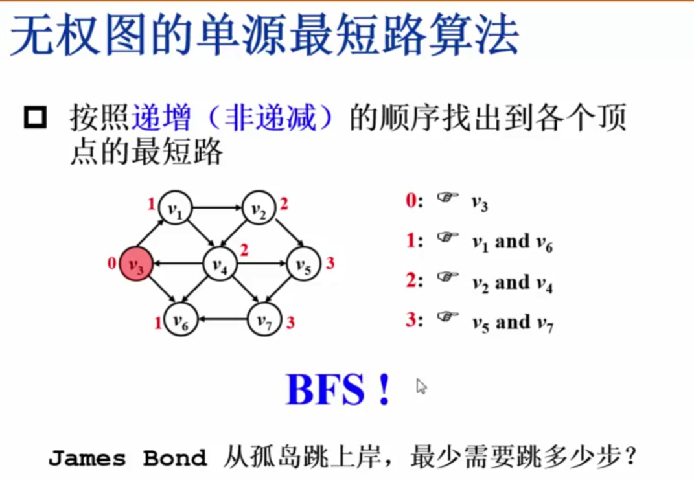
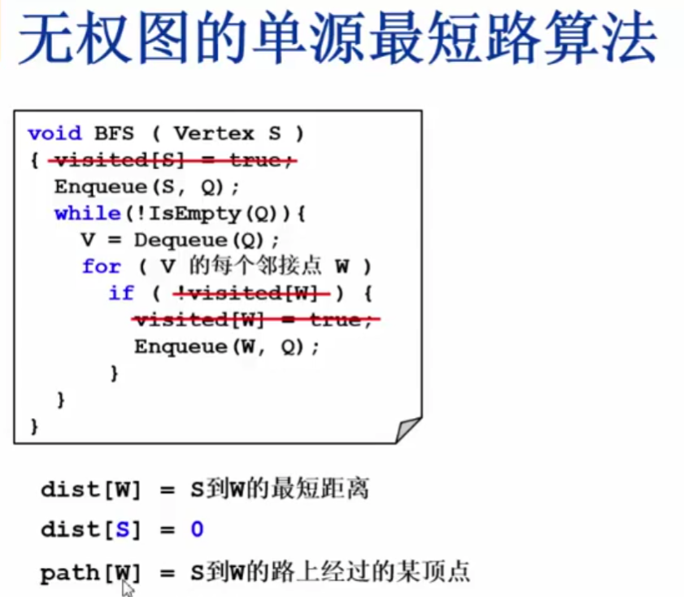
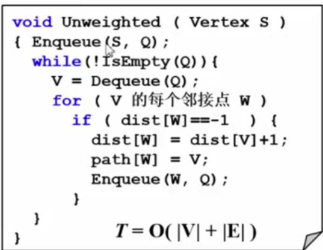
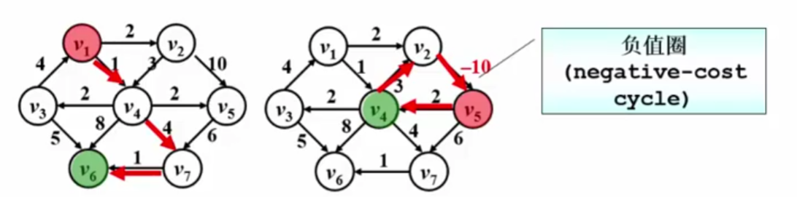
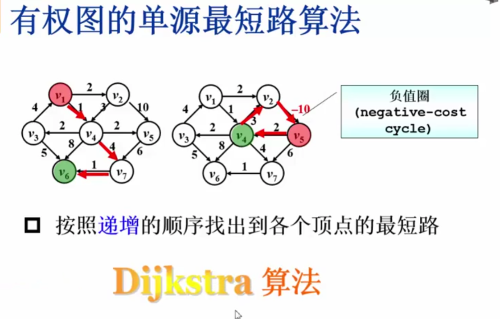
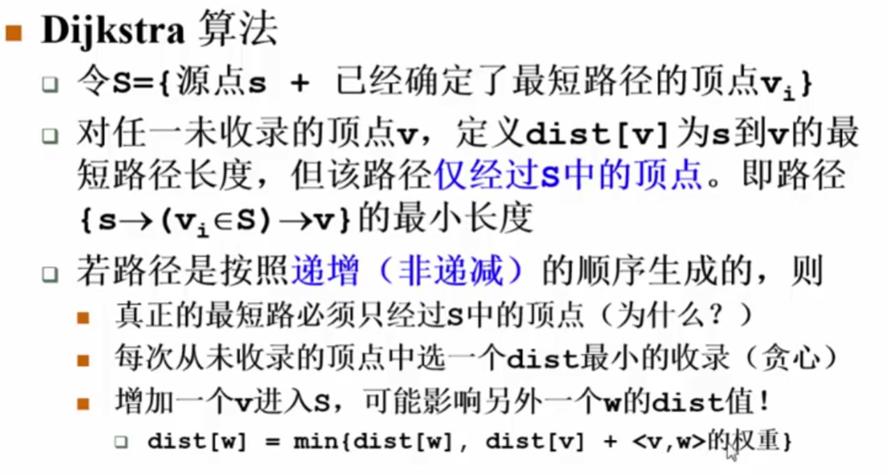
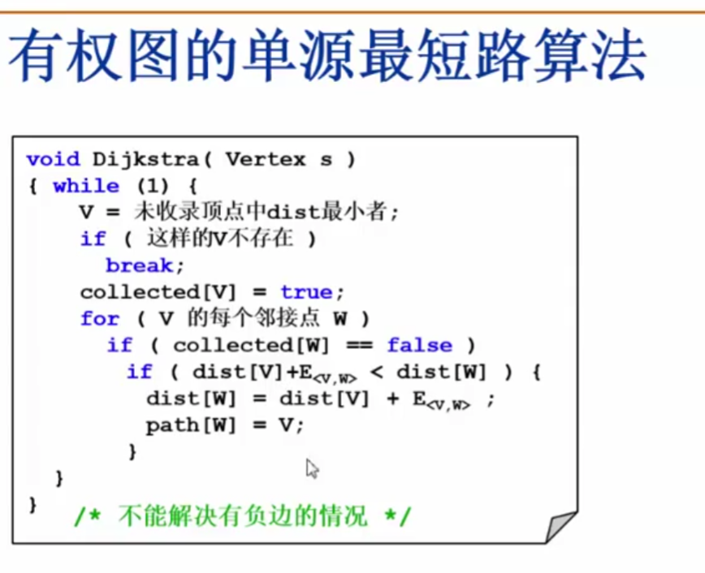

## 最短路径问题：

问题的分类：

### 无权图的单元最短路径算法：
首先从起点的直接邻接点开始出发，一圈一圈往外扩展
递增顺序：先找路径长度为0的节点，其次找长度为1的节点。

其算法和BFS很像。
在BFS基础上进行改动:
把visit数组改外dist数组，来表示源点到某个节点的最短距离。dist数组初始化时应该定义一个一看就是不可能是路径的数。
path数组用来存储最短路径的各个顶点。

算法：

## 有权图的单元最短路径算法：

负值圈：
当权重为负数时，可能出现的情况。我们计算最便宜的路径，可以走一圈我们居然可以净赚五块钱，那么我们不断的绕圈，我们的花费就不断的减少，我们就不断的赚钱。我们不讨论这种情况。

第三小点 因为V是新增的节点，所以路径V的长度应该是最大的才对，那么怎么会影响到其他节点的dist值呢？
那是因为 1.V在 去w 的路径上，2.v w一定有一条直接的边
第2点有些难以理解：
为什么v，w不会出现中间节点呢？ 那是因为 w的dist已经被影响了，但通过dist定义我们可知，w的dist仅仅通过s集合的节点。前面我们已经提到了：v是目前研究的节点，是目前离源点最远的节点。如若有中间节点的话，则那个中间节点到源点的路径一定会大于v，所以不在s里面。恰恰和w的dist定义相反，所以是V W 有一条直接联系的边。
得出结论：
V增加进集合后，它可能会影响它的直接邻接点。

我们把dist数组赋初值的时候注意：源点赋值为0，与其直接相邻的赋值为权重值，其余都是正无穷。