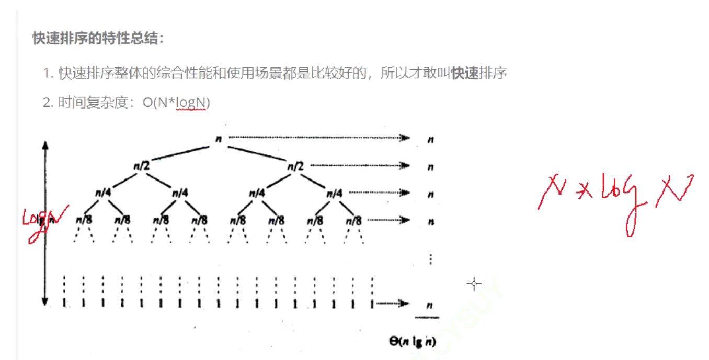
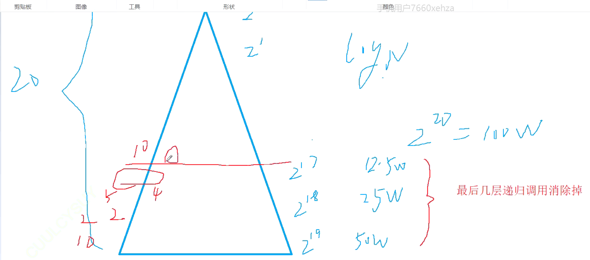

## 快速排序——最快的排序
### 挖坑法：

首先需要选出一个key，一般是第一个或最后一个值为key。
左边有坑，右边找小。右边有坑，左边找大。
最终可以得到一个数组，key左边的值比它小，右边的值比它大。

那么只要key值左边与右边都有序，那么就是有序的。
我们需要使用递归。
代码实现：
```
void quickSort(int *a,int left，int right)
{
    if(left >= right)
        return;
    int begin = 0,end = n-1;
    int pivot = begin;
    int key = a[begin];
    while(begin < end)
    {
        //右边找小，放在左边
        while(begin < end&&a[end] >= key)//这里还需要判断一次，不然的话end，begin会出问题；必须要加等于，否则会导致死循环。当数组中有两个值等于你的key值的时候
        ，就会死循环。
        {
            end--;        
        }    
        a[pivot] = a[end];
        privot = end;
        
        //左边找大，放在右边
        while(begin < end&&a[begin] <= key)
        {
            begin++;        
        }
        a[pivot] = a[begin];
        pivot = begin;
    }
    pivot = begin;
    a[pivot] = key; 
    
    quickSort(a, left，pivot-1);
    quickSort(a,pivot+1， right);
}
```


理想情况下：	都是中间位置privot最终在中间位置


当数组有序的时候，这个时间复杂度是O（n^2）

为了避免快排遇到最坏的情况，此时，key值的取值就尤为关键。方法：三数取中。在数组的left，mid，right中，取中间大小的数为key

优化：
小区间优化：当递归到最后都是小范围的数在递归，大约有几十万次调用。


那么如果数据范围够小，我们就不递归了，我们直接使用插入排序。

这个事优化，但是优化效果不明显。但是要做！


## 左右指针法：

左右指针法和挖坑法整体思路差不多，但区别也很明显。

左右指针法的整体思路是：先去key值，在左边找比key值大的，右边找比key值小的。然后把左边找到的和右边找到的交换，就可以完成一步循环。


## 前后指针法：
定义一个curr指针和prev指针，前后指针。先判断curr的值与key值的大小关系。如果prev值小于key值，prev++，curr++，然后把prev和curr的值交换。
每次curr++后都保证了curr值后面的值都小于了key值。

```
int PartSort3(int *a ,int left, int right)
{
    int key = left;
    int curr = left,prev = left + 1;
    
    while(prev <= right)
    {
        if(a[prev] < a[key])
        {
            ++curr;
            Swap(&a[curr],&a[prev]);                                
        }
        prev++;    
    }
    Swap(&a[key],&a[curr]);
    return prev;
}
```

## 非递归的解法：
递归的缺点：致命的错误，栈溢出。栈帧的深度太深，栈的空间不够用，可能会溢出。
递归改非递归： 两种方法
 1. 简单的改循环。
  2. 用数据结构的栈。

栈帧的栈空间比较小，我们用非递归的话，使用的是堆空间。堆空间可以有几G的空间。
数据结构的栈，堆 和操作系统的空间的栈和堆没有关系。

```
void QuickSortNonR（int *a, int n)
{
    ST st;
    StackInit(&st);
    StackPush(&st,n - 1);
    StackPush(&st,0);
    
    while(!StackEmpty(&st))
    {
        int left = StackTop(&st);
        Stackpop(&st);
        
         int right = StackTop(&st);
         StackPop(&st);
         int keyIndex = PartSort1(*a , left, right);
         
         if(keyIndex + 1 < right)
             StackPush(&st);
        
        if(keyIndex - 1 > left)
            StackPush(&st);                                                
    }
}
```

