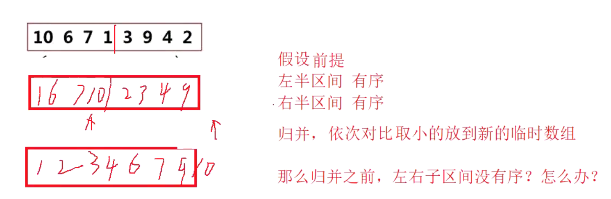
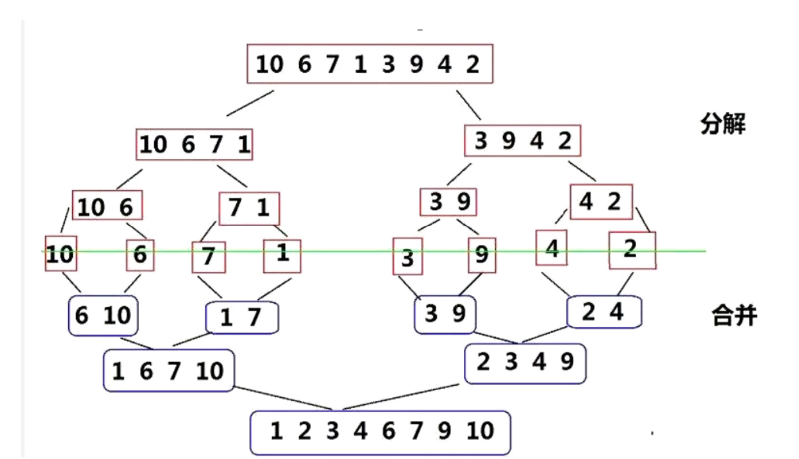

归并排序：假设前提：
左半区间有序，右半区间也有序。  进行归并，依次对取小的放到新的临时数组里面。那么左区间和右区间没有序怎么办？
类似于快排，用递归。




```
void _MergeSort(int* a, int left, int right, int* temp)
{
    if (left >= right)
        return;
    int mid = (left + right) >> 1;
    _MergeSort(a, left, mid, temp);
    _MergeSort(a, mid + 1, right, temp);

    int begin1 = left, end1 = mid;
    int begin2 = mid + 1, end2 = right;
    int index = left;
    while (begin1 <= end1 && begin2 <= end2)
    {
        if (a[begin1] < a[begin2])
            temp[index++] = a[begin1++];
        else
            temp[index++] = a[begin2++];
    }
    while (begin1 <= end1)
        temp[index++] = a[begin1++];
    while (begin2 <= end2)
        temp[index++] = a[begin2++];

    for (int i = left; i <= right; i++)
        a[i] = temp[i];
}

void MergeSort(int* a, int n)
{
    int* temp = (int*)malloc(sizeof(int) * n);
    _MergeSort(a, 0, n - 1, temp);
    free(temp);
}
```


## 非递归实现方法：

我们用循环的方式来实现归并排序的非递归：
1.  首先，gap为1。把区间为gap的相邻的数组开始归并。gap一个循环后*=2，直到gap< n为止。
1. 容易遇到的错误就是数组越界
