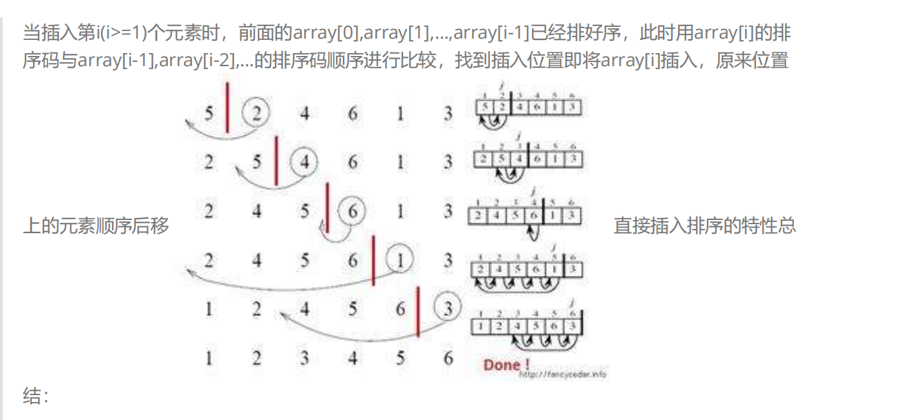
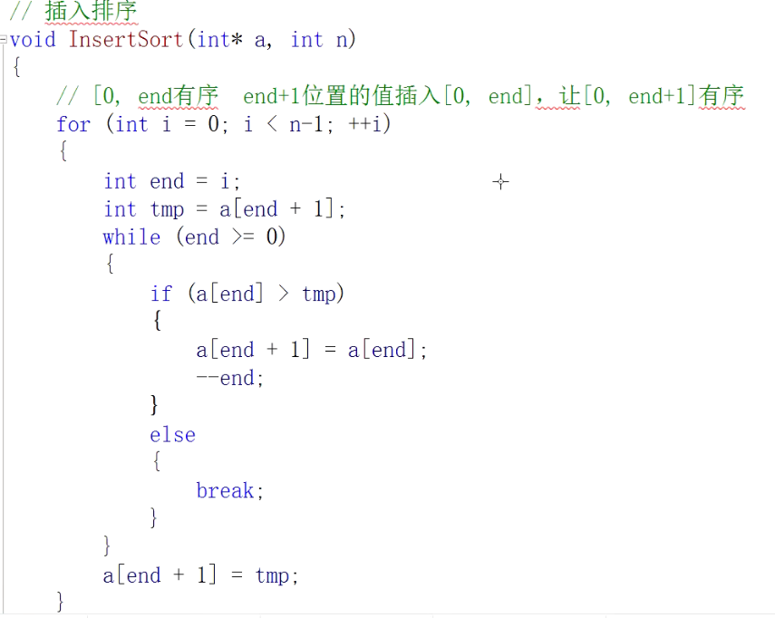
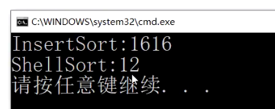
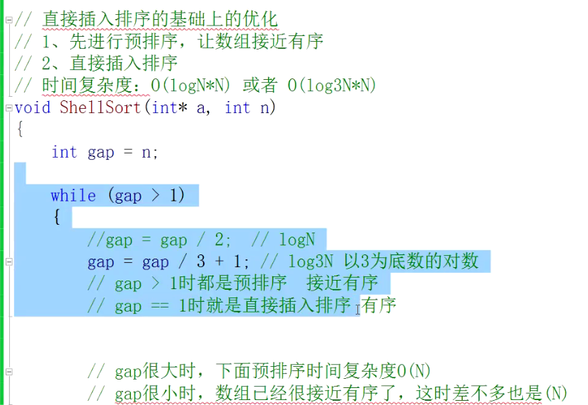

## 直接插入排序
核心思想：在[0 , end] 都有序的情况下，插入a[end+1]要[0 , end+1]有序。



写代码的误区：一定要把end 控制在小于等于n-2。 不然排序失败且数组越界。

代码：



```
void InsetSort(int *a, int n)
{
    for(int i  = 0; i < n-1 ; i++)
    {
        int temp = a[i+1];
        int end = i;
        while(end >= 0)
        {
            if(a[end] > temp)
            {
                     a[end + 1] = a[end];
                     end--;       
            }  
            
                  else   break;   
        }    
        a[end + 1] = temp;
    }
}
```


## 希尔排序：
特殊的插入排序：
      1. 先预排序
   2. 直接插入排序

预排序：
是分组排，间隔为gap的是一组。分组后，在组内排序。 gap是多少就有多少组。分组排的目的是：要大的数更快的移动到后面来，小的数更快的移动到前面去。
多组间隔为gap的预排序，gap由大变小。gap越大，大的数可以越快到后面，，小的数可以越快到前面；gap越大，预排序越不接近有有序。gao越小，越接近有序。gap == 1 时就是直接插入排序。

希尔排序内核：
```
for(int i = 0; i < n - gap; i++) //把间隔为gap的多组数据同时排
{
    int end = i;
    int temp = a[end + gap];
    while(end >= 0)
    {
        if(a[end] >temp)
        {
            a[end + gap] = a[end];
            end -= gap;        
        }    
        else
            break;
    }
    a[end + gap] = temp;
}
```
for(int i = 0; i < n - gap; i++)	
这一行很妙，它避免了二重循环，把多组数据都排好序了。同时i最大值为n-gap-1. 所以终止条件是 < n-gap；

希尔排序重点：gap给多少？
很多种方式，官方没有固定的方式。
一定要保证gap最后值为1；gap/=2 可以保证；
其余最好要是 gap = gap /3 +1;
```
int gap = n;
while（gap > 1)
{
    gap = gap / 2;
}
```


希尔排序比直接排序牛逼N倍。

时间复杂度：


大概是O（N*logN）