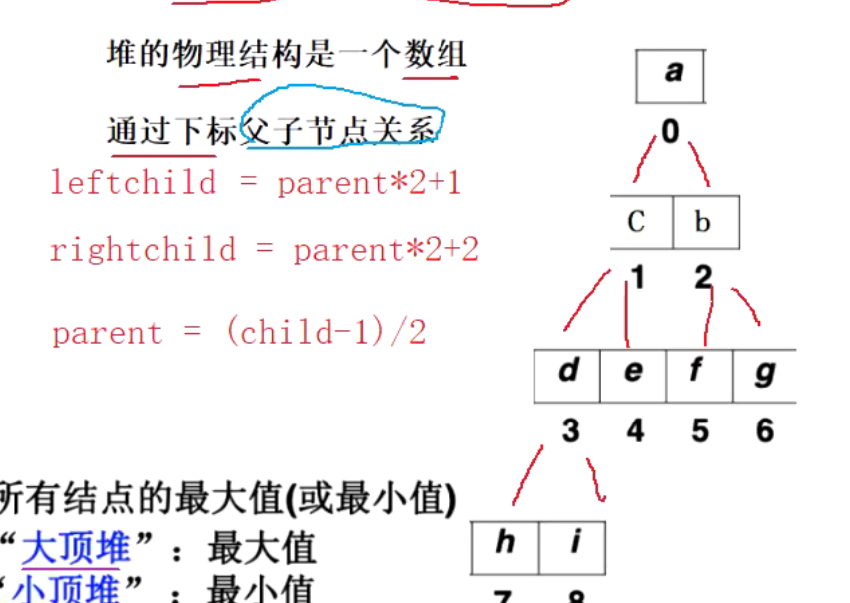
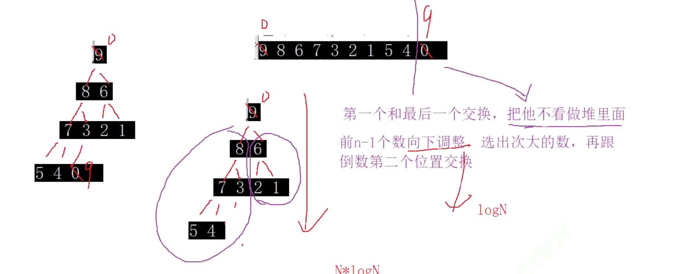
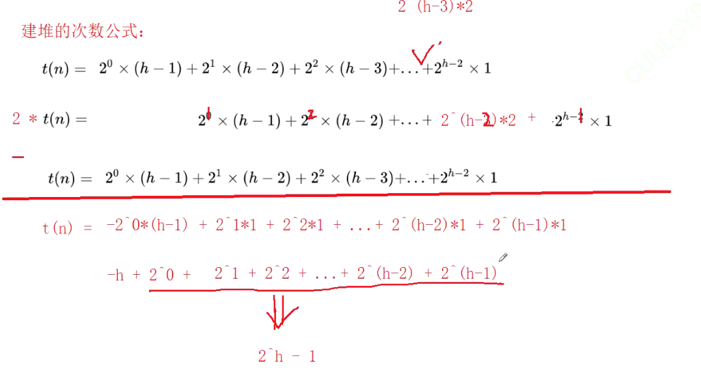
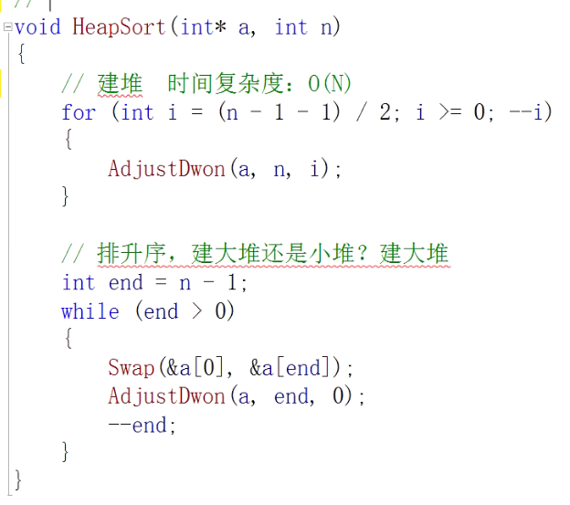

## 堆排序：
堆的逻辑结构是一颗完全二叉树。
堆的物理结构是数组。
通过下标确定父子关系、



堆分为大顶堆和小顶堆。
大顶堆：树中所有的父亲都大于等于孩子。
小顶堆：树中所有的父亲都小于等于孩子。

建小（大）堆方法：
向下调整算法：
前提：子树都是小（大）堆。满足这个前提才能用这个算法。
从根节点开始，选出左右孩子中比较小的那一个，跟父亲比较，如果比父亲小就交换。然后继续下调。调到叶子节点结束。

如果左右子树不是小顶堆或大顶堆，那么就不能使用想向下调整算法了，怎么处理？
先建堆：倒着从最后一颗子树调。即倒着从第一颗非叶子节点的子树开始调。


如果我们需要得到升序排序，我们需要小堆还是大堆？
大堆。
如果是小堆的话，最小树在堆顶，已经被选出来了。那么在剩下的数中再去选数，但是剩下的树结构已经乱了，需要重新建堆才能选出下一个树，建堆的时间复杂度是On，那么这样不是不可以，但是没有效率优势了。




时间复杂度：


等于2^h - 1 - h   =  N - logn;
也就是建堆的复杂度是O（n）
堆排序每个元素的排序的时间是 logN
所以总的时间复杂度是： n + n*logn  所以是O（n*logN）




```
void AdjustDown(int *a,int end, int root)
{
    int parent = root;
    int child = parent*2+1; //
    
    while(child < n)
    {
        if(child+1 < n &&a[child] > a[child +1])
    {
        child++;    
    }
    
    if(a[child] < a[parent])
    {
        swap(a[child],a[parent]);
        parent = child;
        child = parent * 2 +1;    
    }
    else
        break;    
    }
}
```
