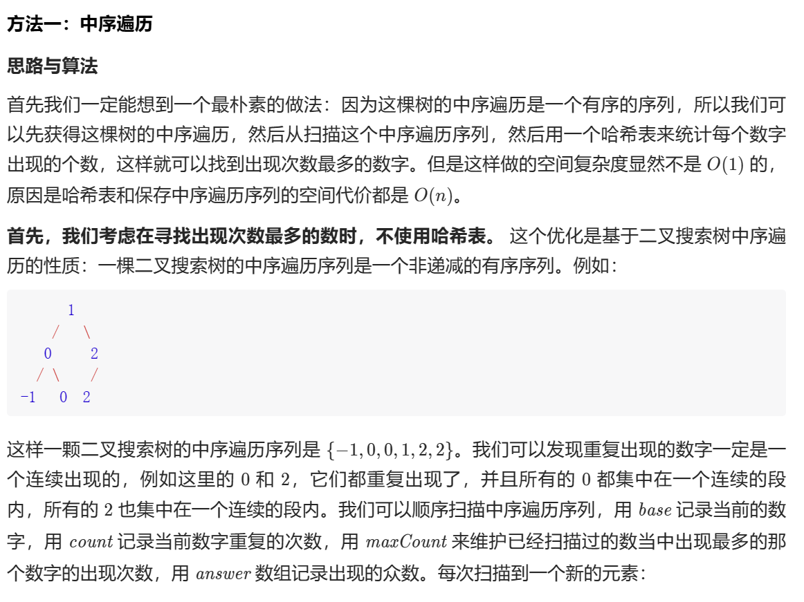

题目：

题解：

重点：	
中序遍历的性质：1.基于二叉搜索树中序遍历的性质：一棵二叉搜索树的中序遍历序列是一个非递减的有序序列
2.因为这棵树的中序遍历是一个有序的序列，所以我们可以先获得这棵树的中序遍历，然后从扫描这个中序遍历序列，然后用一个哈希表来统计每个数字出现的个数，这样就可以找到出现次数最多的数字。可以中序遍历解题。
3.力扣也可以用全局变量，省事儿很多。但要记得在主函数中定义数值。
