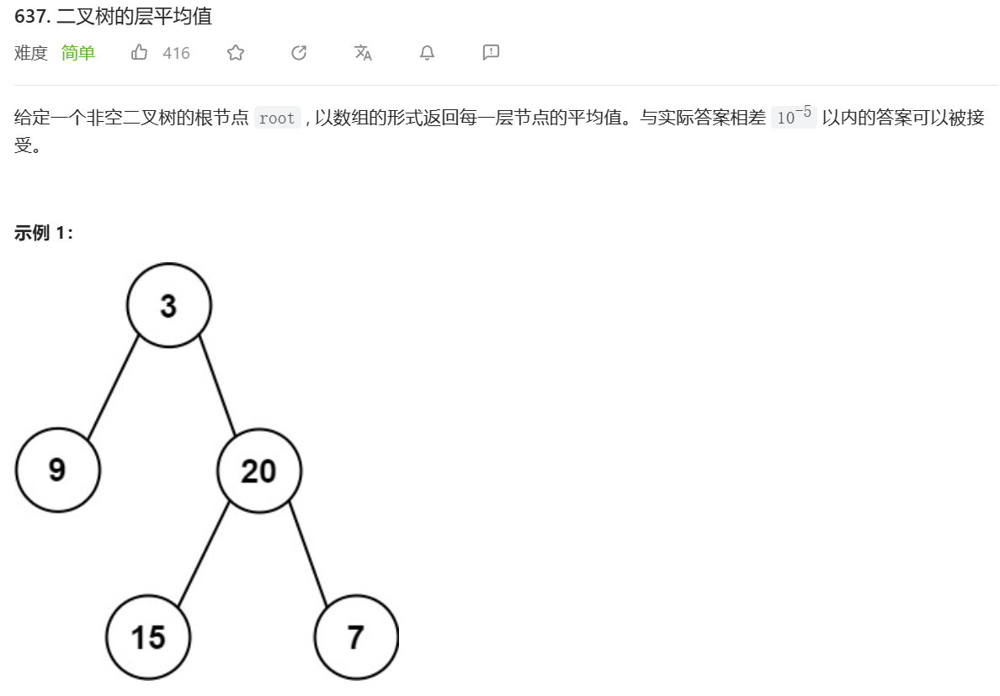

思路：
创造一个数组，以层数为index。这样可以把所有一层的数值加在一起。

题解：
同理，该题中。我们可以创造三个这样的数值，count，sum，aver。
```
void dfs(struct TreeNode* root, int level, int* counts, double* sums) {
    if(root == NULL)return;
    if(level < sumsSize)
    {
        counts[level]++;
        sums[level]+= root->val;
    }
    else
    {
        sums[sumsSize++] = root->val;
        counts[countsSize++] = 1;
    }
    dfs(root->left,level+1,counts,sums);
    dfs(root->right,level+1,counts,sums);
}
double* averageOfLevels(struct TreeNode* root, int* returnSize) {
    countsSize = sumsSize = 0;
    int* counts = malloc(sizeof(int) * 1001);
    double* sums = malloc(sizeof(double) * 1001);
    dfs(root, 0, counts, sums);
    double* averages = malloc(sizeof(double) * 1001);
    *returnSize = sumsSize;
    for (int i = 0; i < sumsSize; i++) {
        averages[i] = sums[i] / counts[i];
    }
    return averages;
}
```
