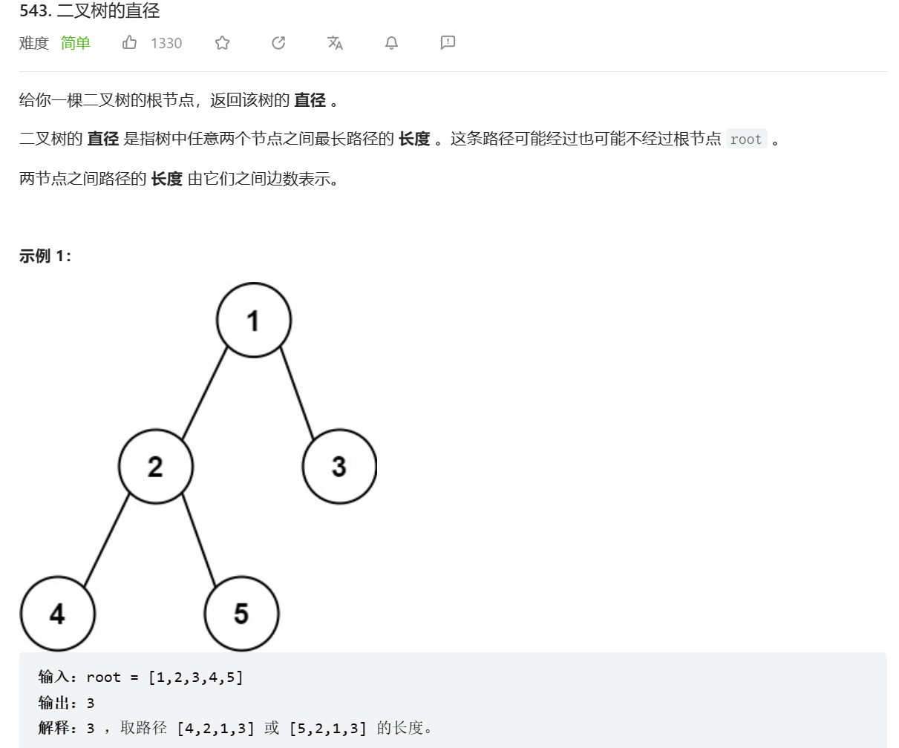
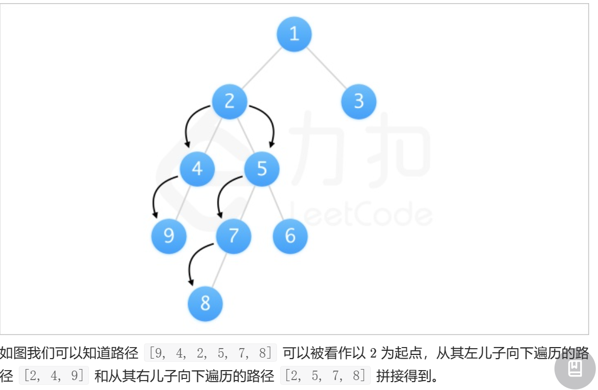
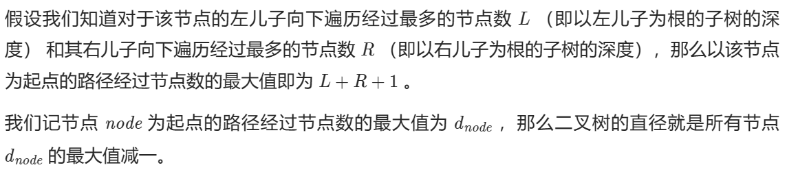

题目：



题解：
```
#define MAX(a,b) (a)>(b)?(a):(b)
int max;
int slove(struct TreeNode *root)
{
    if(root == NULL)    return 0;
    int left = slove(root->left);
    int right = slove(root->right);
    max = MAX(left+right,max);
    return MAX(left+1,right+1);
}
int diameterOfBinaryTree(struct TreeNode* root){
    max = 0;
    slove(root);
    return max;
}
```

思路：
<font color= "#262626">而任意一条路径均可以被看作由某个节点为起点，从其左儿子和右儿子向下遍历的路径拼接得到。所以我们可以遍历所有节点，得到所有节点路径的最大值。</font>




