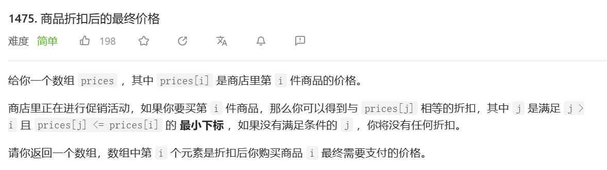
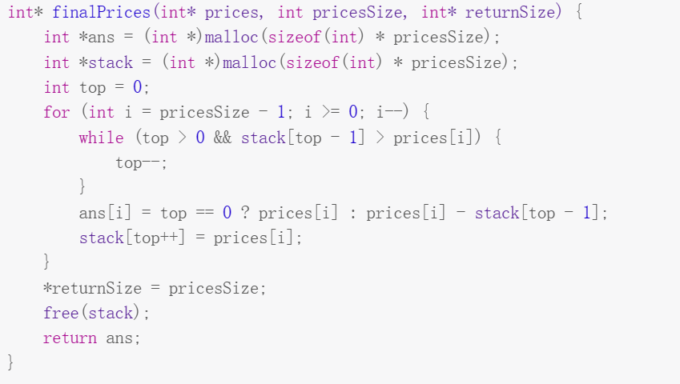

它的特点是栈中的元素是按照一定的顺序排列的，要么是单调递增，要么是单调递减。单调栈可以用来解决一些和数组中元素的相对大小有关的问题，比如找到数组中每个元素的下一个更大（或更小）的元素，或者找到数组中能组成的最大（或最小）的矩形面积等。
单调栈的基本思想是：当一个新元素要入栈时，如果它破坏了栈的单调性，那么就把栈顶的元素出栈，直到新元素可以维持栈的单调性为止。这样，栈中的元素就始终保持了一个有序的状态。同时，每当一个元素出栈时，就可以得到它和新元素之间的关系，从而解决一些问题。
举个例子，假设我们要找到一个数组中每个元素右边第一个比它大的元素，我们可以用一个单调递增的栈来实现。具体步骤如下：
- 遍历数组中的每个元素，记为 x 。
- 如果栈为空，或者 x 小于等于栈顶元素，那么就把 x 压入栈中。
- 如果 x 大于栈顶元素，那么就把栈顶元素出栈，并记录 x 就是它右边第一个比它大的元素。重复这一步骤，直到 x 小于等于栈顶元素或者栈为空为止。
- 把 x 压入栈中。
- 遍历结束后，如果栈中还有元素，那么说明它们右边没有比它们大的元素，可以用一个特殊值表示。
例如，给定数组 [2, 1, 5, 6, 2, 3] ，我们可以用以下过程来找到每个元素右边第一个比它大的元素：
- 遍历到 2 ，栈为空，把 2 压入栈中。
- 遍历到 1 ，1 小于等于 2 ，把 1 压入栈中。
- 遍历到 5 ，5 大于 1 ，把 1 出栈，并记录 5 是 1 右边第一个比它大的元素。5 还大于 2 ，把 2 出栈，并记录 5 是 2 右边第一个比它大的元素。此时栈为空，把 5 压入栈中。
- 遍历到 6 ，6 大于 5 ，把 5 出栈，并记录 6 是 5 右边第一个比它大的元素。此时栈为空，把 6 压入栈中。
- 遍历到 2 ，2 小于等于 6 ，把 2 压入栈中。
- 遍历到 3 ，3 大于 2 ，把 2 出栈，并记录 3 是 2 右边第一个比它大的元素。3 小于等于 6 ，把 3 压入栈中。
- 遍历结束后，栈中还有两个元素：6 和 3 。说明它们右边没有比它们大的元素，可以用 -1 表示。
最终得到结果为：[5, 5, 6, -1, 3, -1] 。这就是每个元素右边第一个比它大的元素
  得到一个数组，直接记录了每一个数右边第一个比它的数。





找右边最小的元素：我们就逆序把数组存进栈，维护递增栈（把比它大的出栈），每次的栈顶元素就是该元素右边第一个比它小的元素。然后把自己入栈。可以以此类推得到我们的所有单调栈的使用方法。

解题方法：



```
```
