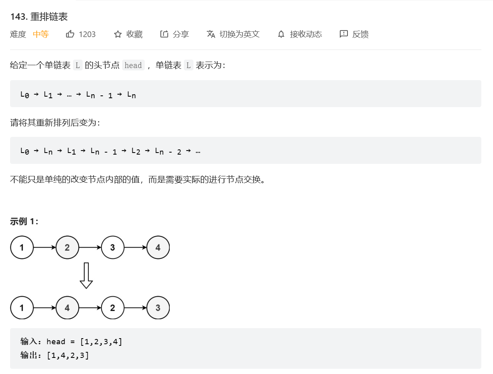

题目：



题解：
```
void reorderList(struct ListNode* head) {
    if (head == NULL) {
        return;
    }
    struct ListNode* vec[40001];
    struct ListNode* node = head;
    int n = 0;
    while (node != NULL) {
        vec[n++] = node;
        node = node->next;
    }
    int i = 0, j = n - 1;
    while (i < j) {
        vec[i]->next = vec[j];
        i++;
        if (i == j) {
            break;
        }
        vec[j]->next = vec[i];
        j--;
    }
    vec[i]->next = NULL;
}
作者：LeetCode-Solution
链接：https://leetcode.cn/problems/reorder-list/solution/zhong-pai-lian-biao-by-leetcode-solution/
来源：力扣（LeetCode）
著作权归作者所有。商业转载请联系作者获得授权，非商业转载请注明出处。
```

思考：
因为链表不支持下标访问，所以我们无法随机访问链表中任意位置的元素。
因此比较容易想到的一个方法是，我们利用线性表存储该链表，然后利用线性表可以下标访问的特点，直接按顺序访问指定元素，重建该链表即可。

所以以后类似的题，我们可以先用线性表存储它，然后就可以使用下标灵活调用它