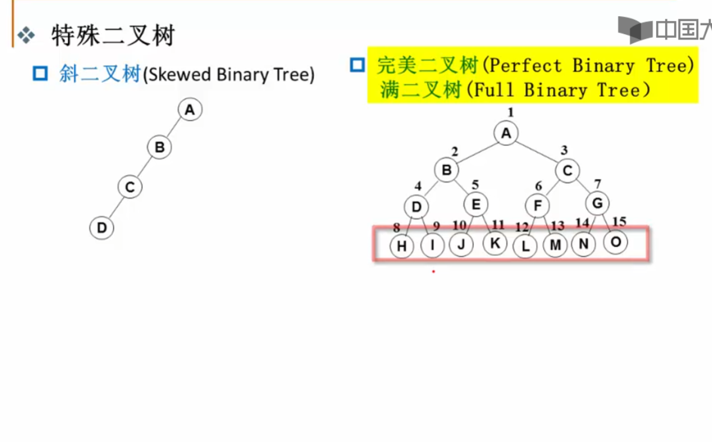
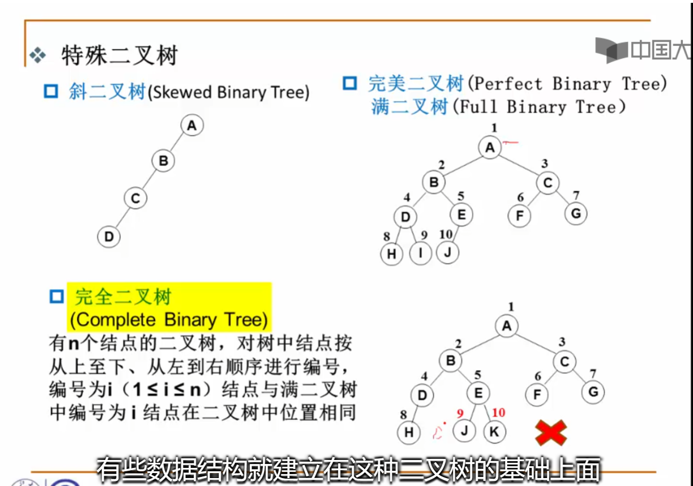
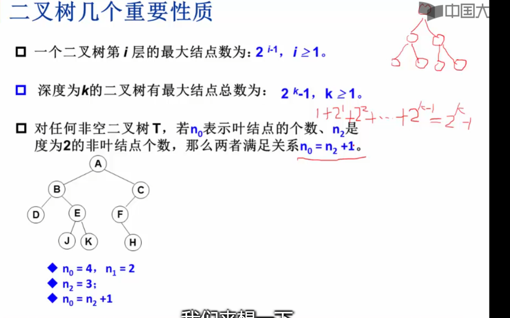
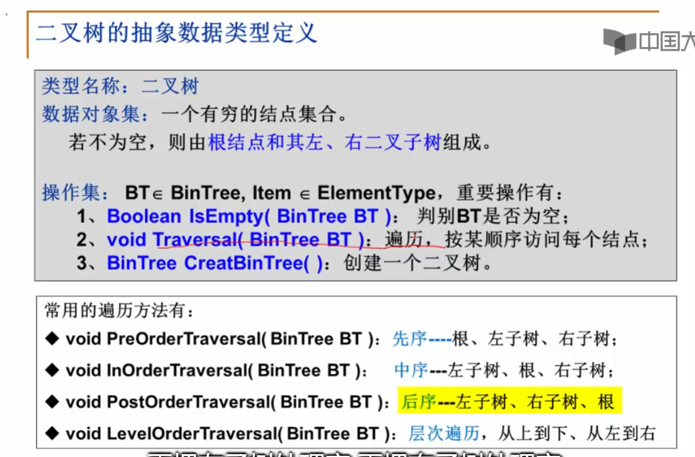

## 特殊二叉树：

斜二叉树：只有左（右）儿子；
完美二叉树：每个根都是左儿子和右儿子。最后的叶节点都在一条直线上。

## 二叉树的性质：

第三个可用边的数量来证明 节点的度是拥有的子树数。
## 二叉树的基本操作：

17. 树的度是树中所有结点的最大度数
18.  在一棵度为3的树中,度为3的结点数为2个,度为2的结点数为1个,度为1的结点数为2个,那么度为0的结点数有(6 )  
因为度数为总结点数-1，则可以立方程解方程可得。

19.任何一棵二叉树的叶子结点在先序、中序、后序遍历序列中的相对次序 不发生改变.

20. 具有n个节点的完全二叉树的深度为 log2n + 1；

21 .  设F是森林,B是由F转换得到的二叉树,F中有n个非终端结点,B中右指针域为空的结点有n+1个

22. 带权路径最优只管原集合中的节点。

23. 