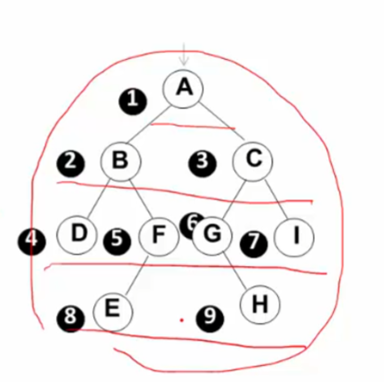

## 二叉树遍历的本质：
二叉树是一个二维结构，但遍历是需要得到一个一维序列（即访问的次序）。则遍历的实质是把二维结构变为一维线性序列的过程。
## 先序遍历：

## 中序遍历：

## 后序遍历：

## 递归遍历实质：

## 非递归遍历：

 运用堆栈的思想

push是第一次遇到，pop是第二次遇到。
## 二叉树的层序遍历：

这样排序的特点是一层一层排序的。如图：

## 例题：

此题中：中序遍历的话会受到运算优先级的影响，导致结果不准确；
解决方法：每次输出左子树时先输出一个括号，其次在输出输出完后再输出一个括号扩回来；

