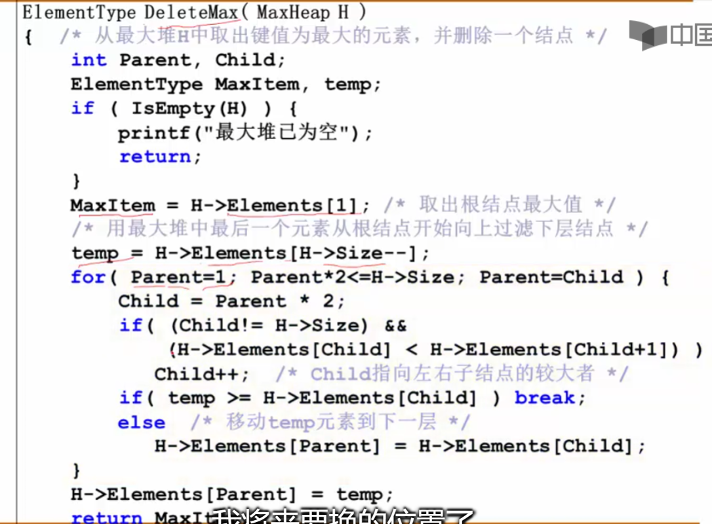
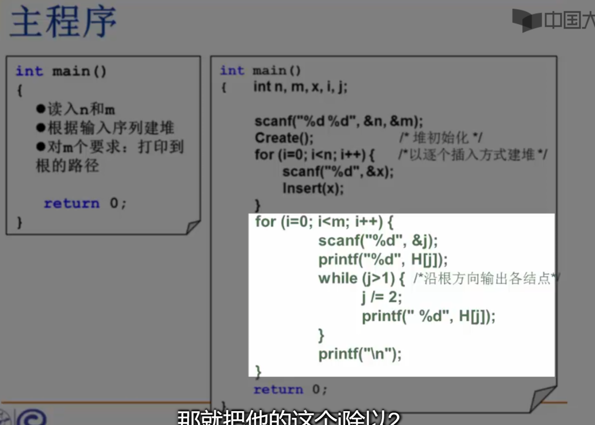

## 堆：
### 堆的定义：


堆的基本操作：插入与删除。


我们用链表和数组来实现优先队列，各有所长。但每个方法总归有不满意的地方。
所以我们用二叉树-堆来表示优先队列。
堆的定义：每个节点都是以自己为根的树的最大值 。且用完全二叉树才存储。


表示要是完全二叉树。
有序性：从上到下画一条路径，这条路径一定是从大到小或从小到大。


### 堆的操作：
创造：


插入：

我们在数组下标为0的位置设置了哨兵，所以我们设置循环条件的时候可以省略i>1 这个条件，提高了效率。
首先插入第一个空白位置，然后不断和自己的父节点比较，如果大于父节点，就和父节点交换。


删除操作：
删除的基本策略：




最大堆的建立：


从最后节点的父节点开始 直到根节点 调成堆；


总代码：
```
typedef struct HNode *Heap; /* 堆的类型定义 */
struct HNode {
    ElementType *Data; /* 存储元素的数组 */
    int Size;          /* 堆中当前元素个数 */
    int Capacity;      /* 堆的最大容量 */
};
typedef Heap MaxHeap; /* 最大堆 */
typedef Heap MinHeap; /* 最小堆 */
#define MAXDATA 1000  /* 该值应根据具体情况定义为大于堆中所有可能元素的值 */
MaxHeap CreateHeap( int MaxSize )
{ /* 创建容量为MaxSize的空的最大堆 */
    MaxHeap H = (MaxHeap)malloc(sizeof(struct HNode));
    H->Data = (ElementType *)malloc((MaxSize+1)*sizeof(ElementType));
    H->Size = 0;
    H->Capacity = MaxSize;
    H->Data[0] = MAXDATA; /* 定义"哨兵"为大于堆中所有可能元素的值*/
    return H;
}
bool IsFull( MaxHeap H )
{
    return (H->Size == H->Capacity);
}
bool Insert( MaxHeap H, ElementType X )
{ /* 将元素X插入最大堆H，其中H->Data[0]已经定义为哨兵 */
    int i;
 
    if ( IsFull(H) ) { 
        printf("最大堆已满");
        return false;
    }
    i = ++H->Size; /* i指向插入后堆中的最后一个元素的位置 */
    for ( ; H->Data[i/2] < X; i/=2 )
        H->Data[i] = H->Data[i/2]; /* 上滤X */
    H->Data[i] = X; /* 将X插入 */
    return true;
}
#define ERROR -1 /* 错误标识应根据具体情况定义为堆中不可能出现的元素值 */
bool IsEmpty( MaxHeap H )
{
    return (H->Size == 0);
}
ElementType DeleteMax( MaxHeap H )
{ /* 从最大堆H中取出键值为最大的元素，并删除一个结点 */
    int Parent, Child;
    ElementType MaxItem, X;
    if ( IsEmpty(H) ) {
        printf("最大堆已为空");
        return ERROR;
    }
    MaxItem = H->Data[1]; /* 取出根结点存放的最大值 */
    /* 用最大堆中最后一个元素从根结点开始向上过滤下层结点 */
    X = H->Data[H->Size--]; /* 注意当前堆的规模要减小 */
    for( Parent=1; Parent*2<=H->Size; Parent=Child ) {
        Child = Parent * 2;
        if( (Child!=H->Size) && (H->Data[Child]<H->Data[Child+1]) )
            Child++;  /* Child指向左右子结点的较大者 */
        if( X >= H->Data[Child] ) break; /* 找到了合适位置 */
        else  /* 下滤X */
            H->Data[Parent] = H->Data[Child];
    }
    H->Data[Parent] = X;
    return MaxItem;
} 
/*----------- 建造最大堆 -----------*/
void PercDown( MaxHeap H, int p )
{ /* 下滤：将H中以H->Data[p]为根的子堆调整为最大堆 */
    int Parent, Child;
    ElementType X;
    X = H->Data[p]; /* 取出根结点存放的值 */
    for( Parent=p; Parent*2<=H->Size; Parent=Child ) {
        Child = Parent * 2;
        if( (Child!=H->Size) && (H->Data[Child]<H->Data[Child+1]) )
            Child++;  /* Child指向左右子结点的较大者 */
        if( X >= H->Data[Child] ) break; /* 找到了合适位置 */
        else  /* 下滤X */
            H->Data[Parent] = H->Data[Child];
    }
    H->Data[Parent] = X;
}
void BuildHeap( MaxHeap H )
{ /* 调整H->Data[]中的元素，使满足最大堆的有序性  */
  /* 这里假设所有H->Size个元素已经存在H->Data[]中 */
    int i;
    /* 从最后一个结点的父节点开始，到根结点1 */
    for( i = H->Size/2; i>0; i-- )
        PercDown( H, i );
}
```

```
void shiftDown(vector<int>& nums, int k)
{
	int leftChild = 2 * k + 1, rightChild = 2 * k + 2;
	int max = k; //假设在当前节点，及其左、右子节点，共三个节点中，最大的是当前这个节点。后序我们就要更新max，看到底哪个才是最大的，把最大的那个和当前节点交换
	if(leftChild < nums.size() && nums[leftChild] > nums[max])
		max = leftChild;
	if(rightChild < nums.size() && nums[rightChild] > nums[max])
		max = rightChild;
	if(max != k)
	{
		swap(nums[max], nums[k]);
		shiftDown(nums, max); // 如果原k节点调整了位置(上一步swap调整)，那么就要将k继续做shiftDown操作，直到它比它的左、右孩子都大
	}
}

void buildMaxHeap(vector<int>& nums)  // 用nums数组表示二叉树
{
	for(int i = nums.size() / 2; i >= 0; i--)  // 从第一个非叶子节点开始，从下往上，将每棵子树调整成最大堆
	{
		shiftDown(nums, i);
	}
}
```
## 哈夫曼树和哈夫曼编码：
### 定义：
例子：


这样的查找效率不高


修改一下判定树，使得效率提高。


所以哈夫曼树解决的问题是：如何根据不同的频率来构造一个效率最高的树。 


构造如下：


我们利用堆来实现哈夫曼树效率更高。


哈夫曼树的特点：


第二点是因为在二叉树中，N0 - 1= N2 总结点数就是N0+N2 为 2n-1；
哈夫曼树不强调左右关系。
虽然不同构，但WPL一样。

### 哈夫曼编码：


不等长编码的关键：避免二义性。


我们把节点编码用二叉树表示，则只要节点是叶子结点，就不会出现二义性的情况。
我们发现这种二叉树表示 总字符串的编码长度就是 哈夫曼树的WPL 所以我们用哈弗曼树表达字符串编码。

## 集合
### 集合的表示和查找：
例子：
并 查集问题。


树的并运算可能会导致合并后的树越来越大，从而导致树越来越高，会影响我们树的查找效率，因此我们尽量把节点数量少的数给接到节点数量大的数上去。 我们可以用根节点的parent部分来表示树的元素数量。


例题：
堆的路径.



