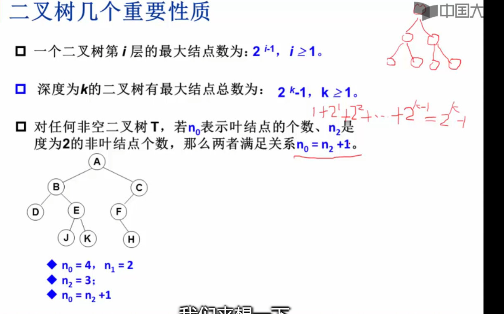
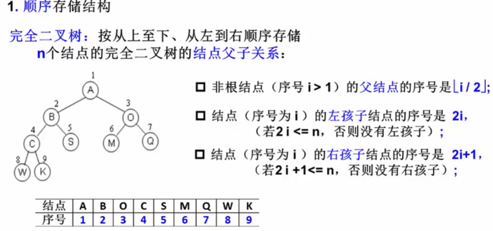

1.队列是限定在端点进行操作的线性表。
2. 同一队列内各元素的类型必须一致。
3. 循环队列占用的空间必须连续。 （因为循环队列本身就是顺序队列）
4.  循环队列的引入,目的是为了克服  假溢出  现象。
5.  顺序队列初始化后,front=rear= 0；
6. 链队列LQ为空时,LQ->front->next=NULL；
7. 在一个链队列中,若队首指针与队尾指针的值相同,则表示该队列为 空；
（链表队列判空的条件有两个：第一，front 的next为NULL；其次就是front == rear）
8.在循环队列中,若尾指针rear大于头指针font, 其元素个数为rear front
9.  在循环链队列中有溢出现象 ， 无假溢出现象。
10. 在C语言中,一个顺序栈一旦被声明,其占用空间的大小 已固定。
11 . 向顺序栈中压入元素时, 先移动栈顶指针,后存入元素.因为，栈顶指针开始时默认指定为-1；

12. 题目中链表实现的东西，都有头结点。

13. 在栈空的情况下,不能做出栈操作,否则产生下溢出（下溢）
14. 递归定义就是循环定义

15. 

16.在下列存储形式中,哪一种不是树的存储形式  顺序存储表示法  有顺序存储，但没有顺序存储表示法。
